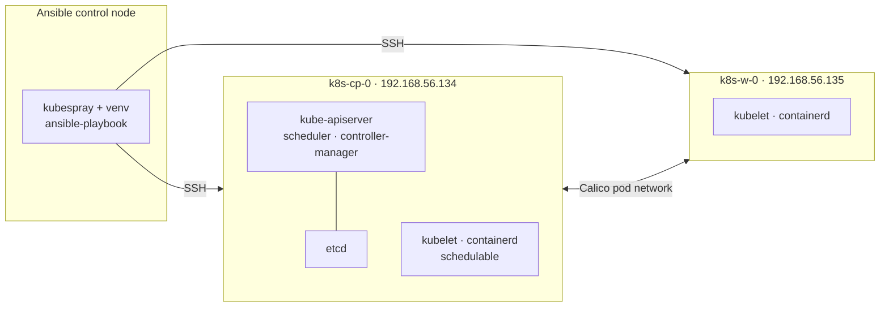

# kubespray-2node-cluster

Reproducible build of a two-node Kubernetes cluster using
[Kubespray](https://github.com/kubernetes-sigs/kubespray) — inventory, automation
scripts, an end-to-end runbook, and a root-cause writeup of the one real failure hit
along the way.


Built and verified end to end on 2026-08-25, then torn down. Every command in
[`docs/runbook.md`](docs/runbook.md) was actually run; the files in [`logs/`](logs/) are
the real output.

---

## Contents

- [Architecture](#architecture)
- [What is in this repo](#what-is-in-this-repo)
- [Quick start](#quick-start)
- [Configuration](#configuration)
- [Documentation](#documentation)
- [Design decisions](#design-decisions)
- [Results](#results)
- [Caveats](#caveats)

---

## Architecture



| Role | Hostname | Address | Inventory groups |
| --- | --- | --- | --- |
| Ansible control node | — | `192.168.56.133` | — |
| Control plane + etcd + worker | `k8s-cp-0` | `192.168.56.134` | `kube_control_plane`, `etcd`, `kube_node` |
| Worker | `k8s-w-0` | `192.168.56.135` | `kube_node` |

The control plane is deliberately **schedulable**: it is listed under `kube_node`, which
makes Kubespray drop the `node-role.kubernetes.io/control-plane:NoSchedule` taint on its
own. No manual `kubectl taint` required.

### Stack

| Component | Version |
| --- | --- |
| Kubernetes | v1.35.4 |
| Kubespray | v2.31.0 |
| etcd | 3.6.10 |
| containerd | 2.2.3 |
| Calico | 3.31.5 |
| Ansible | 11.13.0 (ansible-core 2.18.19) |

Calico CNI · `ipvs` kube-proxy · services `10.233.0.0/18` · pods `10.233.64.0/18` ·
Helm and metrics-server enabled.

---

## What is in this repo

```
.
├── cluster.env.example      # node addresses and paths - copy to cluster.env
├── Makefile                 # make deploy / kubeconfig / reset
├── docs/
│   ├── runbook.md           # every command, in order, start to finish
│   └── coredns-loop-rca.md  # the DNS failure: cause, diagnosis, fix
├── inventory/mycluster/     # Ansible inventory and group_vars
├── logs/                    # real Ansible output from each run
└── scripts/                 # bootstrap · deploy · kubeconfig · reset
```

Kubespray itself is **not vendored** here. You clone it separately and point
`cluster.env` at it, so this repo stays small and never drifts from upstream.

---

## Quick start

Requires `git`, `python3`, `make`, `sshpass`, and SSH access to the nodes.

```bash
# 1. clone kubespray at the matching release
git clone https://github.com/kubernetes-sigs/kubespray.git ~/kubespray
cd ~/kubespray && git checkout v2.31.0

python3 -m venv .venv && source .venv/bin/activate
pip install -r requirements.txt

# 2. clone this repo and wire the two together
git clone https://github.com/rameshwar-dudhe/kubespray-2node-cluster.git
cd kubespray-2node-cluster
cp -r inventory/mycluster ~/kubespray/inventory/

make config          # creates cluster.env - edit it for your addresses
```

Then:

```bash
make ssh PASS=<password>   # install SSH keys on every node
make deploy                # build the cluster (~25 min)
make kubeconfig            # kubectl works locally from here
make reset                 # DESTRUCTIVE - back to bare nodes
```

`make` with no target lists everything:

```
  config       Create cluster.env from the example
  ssh          Install SSH keys on all nodes (make ssh PASS=secret)
  deploy       Build the cluster (~25 min)
  kubeconfig   Fetch kubeconfig from the control plane
  reset        DESTRUCTIVE - tear the cluster down
  lint         Shellcheck the scripts
```

---

## Configuration

All environment-specific values live in `cluster.env`, which is gitignored. Nothing is
hardcoded in the scripts.

| Variable | Meaning |
| --- | --- |
| `KUBESPRAY_DIR` | Path to your kubespray checkout |
| `INVENTORY` | Inventory file, relative to `KUBESPRAY_DIR` |
| `SSH_USER` | Login user on the nodes |
| `SSH_KEY` | Private key used to reach them |
| `NODES` | Every node, space separated |
| `CONTROL_PLANE` | Node that kubeconfig is pulled from |

To target a different environment, edit `cluster.env` and
`inventory/mycluster/inventory.ini`. Nothing else changes.

---

## Documentation

| Document | What it covers |
| --- | --- |
| [`docs/runbook.md`](docs/runbook.md) | Every command in order — prerequisites, inventory, deploy, DNS fix, addons, verification, day-2 operations |
| [`docs/coredns-loop-rca.md`](docs/coredns-loop-rca.md) | Why CoreDNS crashed after a "successful" install, how it was diagnosed, and why the fix belongs in the inventory |

---

## Design decisions

**Inventory hostnames match the real machine hostnames.** Kubespray sets each node's
hostname from `inventory_hostname`. Using placeholders like `node1` would silently
rename the machines.

**The control plane runs workloads.** On a two-node cluster, leaving the control plane
tainted wastes half the capacity. Listing it under `kube_node` is the supported way to
change that.

**Configuration lives in the inventory, never on the nodes.** Anything edited by hand on
a Kubespray-managed node is overwritten on the next converge. The CoreDNS fix is applied
through `upstream_dns_servers`, not by editing `/etc/resolv.conf`.

**A pinned Kubespray release, not `master`.** Deploys are reproducible only against a
tag.

---

## Results

| Run | Duration | Outcome |
| --- | --- | --- |
| `cluster.yml` | 25m 32s | `failed=0` on both nodes |
| CoreDNS fix (tagged re-run) | 54s | `failed=0` |
| Helm + metrics-server | 4m 32s | `failed=0` |
| `reset.yml` | 2m 42s | `failed=0` |

Verified after deploy:

- Both nodes `Ready`, 15/15 pods `Running`, `/healthz` ok
- No taints on either node — control plane schedulable as intended
- Internal DNS, service DNS and **external** DNS all resolving
- Cross-node pod-to-pod traffic over Calico
- Service VIP load-balancing split evenly across both nodes
- `kubectl top nodes` returning metrics; Helm v3.18.4 available

---

## Caveats

> **A green Ansible run is not a healthy cluster.**
> This deploy exited `0` with `failed=0` while DNS was completely broken. Always verify
> with `kubectl get pods -A`. See [`docs/coredns-loop-rca.md`](docs/coredns-loop-rca.md).

- **Ubuntu 26.04 is not on Kubespray's supported list** (v2.31.0 supports 22.04 and
  24.04). It worked here — the version-gated tasks are in the `docker` role, unused
  because `container_manager: containerd` installs upstream binaries — but it is
  untested upstream and is the first thing to suspect if a run breaks.
- **Firewalls must be off.** Kubespray does not manage them; `ufw` was disabled on both
  nodes.
- **Single control plane, no HA.** Suitable for a lab, not production.
- **Generated credentials are never committed.** `inventory/*/credentials/` and
  `cluster.env` are gitignored.

---

## License

[MIT](LICENSE)
